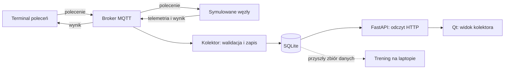

# EdgeGuard IoT — co budujemy i co powinieneś umieć wyjaśnić

Stan na 23.09.2026, po dodaniu pilota obserwowalności bramy. Ten przewodnik opisuje
stan kodu i ścieżkę nauki, nie gotową magisterkę ani wynik skuteczności ML.

## 1. Cel w kilku zdaniach

Budujesz laboratorium inteligentnego domu, w którym urządzenia wymieniają dane
i polecenia przez MQTT. Docelowo będą to 1–3 ESP32 oraz dodatkowe węzły
symulowane. Raspberry Pi ma zbierać dane i uruchamiać detektor anomalii.
Modele będziesz trenował na laptopie. Obecnie wszystkie urządzenia zastępuje
Python, dzięki czemu możesz rozwijać projekt bez złożonej elektroniki.

Pytanie badawcze: **czy model uczący się zależności czasowych między poleceniami,
odpowiedzią mechanizmu i komunikacją wykrywa wybrane nieprawidłowości lepiej
niż dobrze dobrane proste metody, przy akceptowalnym koszcie na Raspberry Pi?**
Nie zakładamy odpowiedzi „tak”. Trzeba to zmierzyć i wyjaśnić również porażki.

## 2. Co dziś jest zrobione

| Stan | Element | Co dokładnie oznacza |
|---|---|---|
| ✓ | Model domu w Pythonie | 4 kanały gazu, 4 wentylatory, 10 świateł, 6 serw; konfigurowalny podział na węzły |
| ✓ | Konsola Qt | Makieta, sterowanie lokalnym modelem, wykresy wszystkich komponentów, eksport i odtwarzanie lokalnych przebiegów |
| ✓ | Cztery scenariusze | Wzrost sygnału gazu, zamrożony czujnik, awaria wentylatora, utrata łączności węzła |
| ✓ | Kontrakty JSON 1.0 | Walidacja formatu telemetrii, poleceń i wyników |
| ✓ | MQTT → SQLite | Prawdziwy lokalny broker, kolektor, zapis i odczyt telemetrii |
| ✓ | API i podgląd kolektora w Qt | Odczyt zapisanej telemetrii przez HTTP; rozdzielone sesje urządzeń |
| ✓ | Polecenia przez MQTT z terminala | Nastawy i AUTO, odpowiedzi, ważność, pamięć wyników i odrzucanie konfliktów |
| ✓ | Historia sterowania | Trwałe obserwacje poleceń/wyników, powtórzenia, czasy odbioru, stronicowany odczyt API |
| ✓ | GitHub i testy | Testy lokalne oraz CI; wersjonowane źródła i dokumentacja |
| ✓ | Rusztowanie LaTeX | Rozdziały, bibliografia, budowanie i eksport do Overleaf; nie kompletna treść pracy |
| Plan | Główne badanie ML | Dane eksperymentalne, cechy, trening GRU/Isolation Forest, porównanie, analiza błędów |
| Plan | Generator życia rodziny | Zróżnicowane dni, długie sesje i eksperymenty; obecny model ma limity krótkiego przebiegu |
| ✓ | Pilot ruchu i feedbacku | Osobny model bramy, kontakty, opcjonalny syntetyczny prąd i runner czterech przypadków; [krok 11](step-11-gate-pilot.md) |
| Plan | Integracja feedbacku | Rozszerzenie telemetrii, MQTT/Qt oraz kalibracja i walidacja fizyczna |
| Plan | Sterowanie MQTT z przycisków Qt | Obecnie przyciski sterują tylko lokalną symulacją |
| Plan | Sprzęt i wdrożenie | Firmware ESP32, poświadczenia/ACL, prawdziwe pomiary i koszty inferencji na Pi |
| Opcja | Tablice samochodzika albo głos | Jeden dodatek po pilocie głównego ML; nie gotowa funkcja |

„✓” oznacza działający zakres opisany w wierszu, nie produkcyjną gotowość.
Obecne alarmy progowe są regułami; **wytrenowany detektor ML jeszcze nie działa**.
Milestone 1 nie jest formalnie zamknięty: pozostają m.in. dopracowanie kompletnego
demo, obsługi awarii/przeciążenia i docelowej dokumentacji architektury.

## 3. Przepływ danych — kto co robi

**Symulator** odgrywa rolę urządzeń. **Broker Mosquitto** przekazuje wiadomości
według adresów zwanych topicami. **Kolektor** odbiera je, sprawdza i zapisuje.
**SQLite** przechowuje historię w pliku. **FastAPI** udostępnia odczyt historii
przez HTTP. **Qt** jest interfejsem. Żaden z tych elementów sam nie „uczy się domu”.

Są dziś dwa tryby pracy. **Makieta lokalna w Qt** ma własny model w pamięci
i nie publikuje jego stanu do brokera. **Symulator MQTT z terminala** jest
oddzielnym procesem modelu, a widok „Kolektor — dane z API” odczytuje jego historię.
Przełączenie widoku Qt nie łączy obu modeli. To istotna granica obecnej integracji.

## 4. Prześledź jedną lampę

1. Symulowany węzeł wysyła raport `led_01: commanded=0, reported=0`.
2. Nadawca terminalowy odbiera nową telemetrię, bierze `boot_id` i uptime.
3. Wysyła polecenie `set`, `value=1`, nowe `command_id` oraz okno ważności.
4. Broker przekazuje polecenie węzłowi i kolektorowi. Kolektor zapisuje odbiór.
5. Węzeł sprawdza format, własną sesję, termin, komponent, wartość i duplikaty.
6. Zmienia nastawę i publikuje `accepted`. Kolektor zapisuje tę odpowiedź osobno.
7. Następna telemetria pokazuje nowy stan. API udostępnia zapisane wiadomości.

Trzy różne potwierdzenia:

- **PUBACK brokera:** broker odebrał publikację.
- **`accepted` węzła:** sterownik przyjął nastawę/tryb.
- **Raport/pomiar odpowiedzi:** obserwacja stanu; dziś `feedback=simulated`.

Można przyjąć polecenie uruchomienia wentylatora, który z powodu awarii się
nie obraca. Dlatego samo `accepted` nie zastępuje niezależnego pomiaru ruchu.
To właśnie relację między tymi informacjami chcemy analizować w ML.

## 5. Słownik, który warto opanować

| Pojęcie | Znaczenie w naszym projekcie |
|---|---|
| Węzeł / `device_id` | Jedno urządzenie komunikujące się przez MQTT; dziś symulowane |
| Komponent / `component_id` | Konkretna lampa, czujnik, serwo lub wentylator na węźle |
| Telemetria | Wiadomość o odczytach i stanach urządzenia |
| Kontrakt / schema | Uzgodnione pola, typy i ograniczenia wiadomości |
| `boot_id` | Identyfikator sesji urządzenia; po nowym starcie ma być inny |
| `sequence_number` | Kolejny numer raportu w tej sesji |
| `command_id` | ID logicznego polecenia, zachowywane przy jego ponowieniu |
| QoS 1 | Dostarczenie może się powtarzać; nie gwarantuje jednokrotnego wykonania |
| Deduplikacja | Rozpoznanie powtórzenia; węzeł nie powtarza tej samej operacji |
| Transakcja | Zapis kończy się zatwierdzeniem albo wycofaniem zmian |
| API | Umówiony sposób komunikacji z programem; u nas odczyt HTTP |
| Seed | Ziarno generatora losowego dla odtwarzalnego przebiegu |
| Ground truth | Znana etykieta scenariusza do oceny; nie podpowiedź dla modelu |
| Trening / inferencja | Uczenie parametrów z danych / użycie wyuczonego modelu |
| Baseline | Prosta metoda odniesienia, z którą uczciwie porównujemy ML |
| CI | Automatyczne sprawdzanie zmian na GitHubie |

Sesja kolektora to jeszcze inne ID niż `boot_id` urządzenia. Kolektor ma swój
czas odbioru, a urządzenie własny uptime. Nie mieszamy tych zegarów w obliczeniach.
MQTT i HTTP także pełnią inne role: urządzenia publikują przez MQTT, a interfejs
odpytuje API przez HTTP.

## 6. Gdzie szukać kodu

| Plik / katalog | Przeczytaj, żeby zrozumieć |
|---|---|
| [simulator/house.py](../simulator/house.py) | Stan domu, krok czasu, komendy, scenariusze; zacznij od `command()` i `step()` |
| [simulator/control.py](../simulator/control.py) | Walidację celu, pamięć wyników, kolejkę i odbiór poleceń |
| [simulator/mqtt.py](../simulator/mqtt.py) | Uruchomienie modelu i publikowanie telemetrii |
| [edge/command.py](../edge/command.py) | Nadawcę pojedynczego polecenia z terminala |
| [contracts/](../contracts) | Wspólny język wiadomości i walidatory |
| [edge/mqtt.py](../edge/mqtt.py) | Połączenie, publikację, subskrypcje i potwierdzenia MQTT |
| [edge/collector.py](../edge/collector.py) | Odbiór trzech strumieni i zapis przed ACK |
| [edge/storage.py](../edge/storage.py) | SQLite i deduplikację telemetrii |
| [edge/observations.py](../edge/observations.py) | Oddzielne obserwacje poleceń/wyników i ich odczyt |
| [edge/api.py](../edge/api.py), [edge/readings.py](../edge/readings.py) | Endpointy HTTP i zapytania odczytujące historię |
| [simulator/desktop/](../simulator/desktop) | Interfejs Qt; nie trening ML |
| [tests/](../tests) | Przykłady oczekiwanego działania i sprawdzane granice |
| [thesis/](../thesis) | Tekst pracy i jej budowanie |

Python to język. Qt/PySide6, FastAPI, Paho i jsonschema są bibliotekami,
Mosquitto jest brokerem, SQLite silnikiem bazy. Twój wkład to m.in. model,
kontrakty, integracja, scenariusze, protokół badań i analiza wyników. Korzystanie
z bibliotek nie oznacza oddania im autorstwa całego projektu; zależności
i źródła trzeba rozumieć, wskazać i respektować ich licencje.

## 7. Co konkretnie wniesie ML

Generator rodziny ma dostarczać różne poprawne sekwencje zachowań. Detektor
ma uczyć się ich zależności, a później wyznaczać wynik nietypowości nowych danych.
Proponowany GRU przewiduje następne obserwacje; błąd predykcji jest kandydatem
na wynik anomalii. Isolation Forest analizuje cechy z okien, np. częstości,
odstępy i zmiany. Porównamy je z regułami i prostymi modelami statystycznymi.

To nadal hipotezy projektowe. Jeśli model uczy się tylko sztucznego rozkładu
naszego generatora, dobry wynik na niemal identycznych danych nie wystarczy.
Potrzebujemy wydzielonych przebiegów, legalnych wyjątków, testu fizycznego,
liczby fałszywych alarmów i kosztu inferencji. 1095 skopiowanych dni nie zastąpi
różnorodności. Rozpoznawanie tablic samochodzika jest opcją dodatkową.

Pełne uzasadnienie i pomysły: [plan badań ML](ml-research-plan.md).

## 8. Ćwiczenie na dziś i sprawdzenie zrozumienia

Przejdź [krok 9](step-09-mqtt-control.md), następnie [krok 10](step-10-control-history.md).
Włącz lampę, znajdź polecenie, wynik i nową telemetrię. Potem wyślij do lampy
wartość 110: porównaj odrzucenie z poprawnym przyjęciem wartości 1.
Zwróć uwagę, że nowe wywołanie CLI tworzy nowe ID — nie jest próbą tego samego żądania.

Po ćwiczeniu spróbuj odpowiedzieć własnymi słowami:

1. Dlaczego `accepted` nie oznacza, że fizyczna brama się otworzyła?
2. Po co mamy broker, skoro jest baza i API?
3. Dlaczego węzeł odrzuca duplikat wykonania, a kolektor zachowuje kolejny odbiór?
4. Co się zmienia przy restarcie węzła, a co przy restarcie kolektora?
5. Dlaczego alarm gazowy widoczny dzisiaj nie jest wynikiem ML?
6. Czy przycisk w lokalnej makiecie Qt steruje procesem symulacji MQTT?
7. Dlaczego dobry wynik na syntetycznych danych nie dowodzi działania na ESP32?

Odpowiedzi znajdziesz powyżej. Uczymy się w tej kolejności: jedna lampa i przepływ
wiadomości → kontrakty i błędy → historia i cechy → eksperyment ML → sprzęt.
Nie musisz pamiętać każdej linii biblioteki. Powinieneś umieć wyjaśnić własne
decyzje, prześledzić przepływ danych i pokazać test potwierdzający zachowanie.
