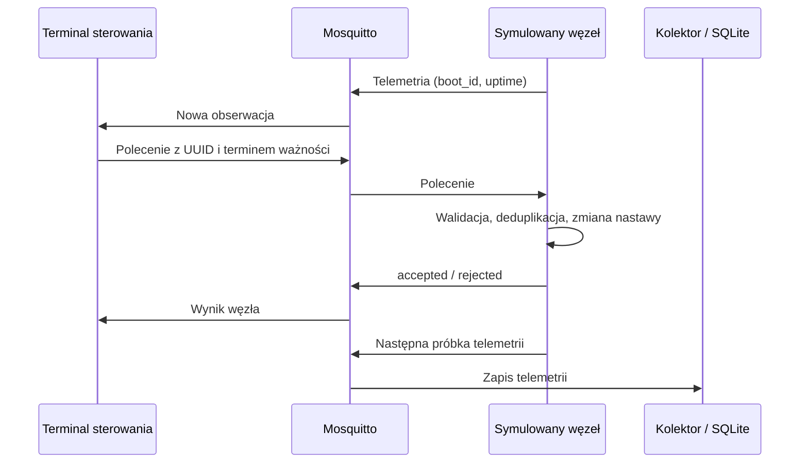

# Krok 9 — sterowanie symulowanym węzłem przez MQTT

Polecenie przechodzi teraz przez prawdziwy broker do tego samego modelu domu,
którego używa Qt. Odbiornik zmienia nastawę, odsyła wynik i publikuje kolejną
telemetrię. To osobny proces symulacji; przyciski lokalnej makiety Qt nadal
sterują jej własnym modelem w pamięci.



## Uruchomienie bez elektroniki

W terminalach pracuj w katalogu `A:\projects\edgeguard-iot`.
Przygotowanie zależności i brokera opisuje [krok 5](step-05-mqtt.md).
Jeżeli broker i kolektor już działają, nie uruchamiaj ich ponownie.

**Terminal 1 — broker:**

```powershell
.\.tools\mosquitto\mosquitto.exe -c mqtt/mosquitto-local.conf
```

**Terminal 2 — zapis do bazy:**

```powershell
.\.venv\Scripts\python.exe -m edge.collector --database data/telemetry.sqlite3
```

**Terminal 3 — symulacja z odbiorem poleceń, 300 kroków:**

```powershell
.\.venv\Scripts\python.exe -m simulator.mqtt --commands --nodes 1 --extra-nodes 2 --steps 300
```

Poczekaj na `Command receiver ready`. Dla nauki używamy jednego węzła z domem
i dwóch dodatkowych czujników. `--nodes 2` albo `3` rozdziela komponenty między
węzłami; adres komponentu sprawdzisz w telemetrii. Na jednym brokerze uruchamiaj
tylko jeden proces publikujący dla danego `device_id`; nie startuj równolegle
starego publishera z tymi samymi ID. Każdy nowy przebieg otrzymuje nowe `boot_id`.

**Terminal 4 — włączenie lampy:**

```powershell
.\.venv\Scripts\python.exe -m edge.command --device esp32_node_01 --component led_01 --value 1
```

Najpierw zobaczysz wysłane `command`, następnie `result`. Oczekiwany status:
`accepted`. W kolejnej telemetrii lampy `commanded` oraz symulowane `reported`
wynoszą 1. Możesz je odczytać w [widoku kolektora Qt](step-07-collector-view.md),
jeżeli API korzysta z tej samej bazy. Lokalne okno makiety nie zmieni stanu.

Wyłączenie: `--value 0`. Serwo: `--component servo_01 --value 110`.
Wentylator ręcznie: `--component fan_01 --value 1`; powrót do automatyki:
`--component fan_01 --auto`. Nie łącz `--auto` z `--value`.
Próba `--component led_01 --value 110` powinna zwrócić `value_out_of_range`.

Nadawca czeka do 8 s na nową telemetrię z MQTT bez flagi retained, a następnie do
8 s na wynik węzła. Nie korzysta ze starej historii API. Ważność polecenia wynosi
5 s **czasu logicznego węzła** od obserwacji. Powolna sieć wydłuża rzeczywisty
czas kroków; nie jest to gwarancja deadline'u czasu rzeczywistego. Kod wyjścia:
0 — przyjęte, 2 — odrzucone, 1 — problem wymiany. Brak wyniku po wysłaniu oznacza
wynik nieznany. CLI nie ponawia automatycznie; kolejne uruchomienie tworzy nowe ID.

## Zabezpieczenia i jawne ograniczenia

- Identyczne ID i treść w tej samej sesji zwracają pierwotny wynik bez ponownej
  zmiany nastawy, również po wygaśnięciu. Zmieniona treść pod tym ID daje
  `duplicate_conflict`. Stara sesja daje `wrong_boot`.
- Limit pamięci to 256 wyników na węzeł, bez usuwania wpisów w trakcie przebiegu.
  Po zapełnieniu nowe żądania dostają `capacity_exceeded`. Osobno obowiązuje
  wspólny limit 1000 akcji modelu. Nowy przebieg resetuje pamięć i zmienia sesję.
- Kolejka ma 64 polecenia po maksymalnie 4 KiB, jedna obsługa przetwarza najwyżej
  16. Nadmiar zwiększa `queue_full` i jest pomijany bez wyniku aplikacyjnego.
  Uszkodzone wiadomości zwiększają `invalid`. Nie wymyślamy dla nich ID odpowiedzi.
- Węzeł z zasymulowaną utratą łączności nie wykonuje żądania ani nie odpowiada.
  Ważność i dostępność sprawdzamy ponownie przy obsłudze, po oczekiwaniu w kolejce.
- Wynik zapisujemy w pamięci przed publikacją. Zerwanie połączenia kończy przebieg;
  nie ma automatycznego restartu odbiornika ani trwałej pamięci deduplikacji.
  Nie deklarujemy gwarancji jednokrotnego wykonania przez awarię procesu.
- `accepted` dotyczy nastawy/trybu, a nie osiągnięcia pozycji. Przy zasymulowanej
  awarii wentylatora przyjęte polecenie może współistnieć z `reported: 0`.
- QoS 1 i `retain=false` stosujemy do poleceń oraz wyników. Migawki oznaczone
  retained przy nowej subskrypcji są pomijane. MQTT 3.1.1 usuwa tę flagę przy
  dostarczeniu do już aktywnej subskrypcji, więc sam odbiornik nie wykryje każdego
  klienta publikującego z retain. To wynika z [MQTT 3.1.1, §3.3.1.3](https://docs.oasis-open.org/mqtt/mqtt/v3.1.1/os/mqtt-v3.1.1-os.html).
- Nadal używamy wyłącznie loopbacka. ID i deadline nie uwierzytelniają klienta;
  poświadczenia i ACL są osobnym wymaganiem przed wdrożeniem sieciowym.

Archiwum `experiments/runs/<run-id>-mqtt.json` zawiera akcje modelu, stan,
telemetrię i diagnostykę `control`: liczniki, liczbę oczekujących żądań przy
zatrzymaniu oraz ostatnie 1000 par polecenie–wynik. `evicted_events` liczy usunięte
wpisy diagnostyczne. Bufor telemetrii także pozostaje ograniczony do 3000 wiadomości.
`broker_acked` obejmuje telemetrię i wyniki; osobne liczniki są w `control`.

To archiwum diagnostyczne symulatora, nie trwały audyt gatewaya ani kompletny
zbiór treningowy. SQLite zapisuje na razie telemetrię, nie polecenia i wyniki.
Rozszerzonego archiwum MQTT nie importujemy przez przycisk odtwarzania Qt.
Normalne zakończenie/Ctrl+C zapisuje archiwum; wymuszone zabicie procesu może
przerwać zapis. Plików wygenerowanych nie dodajemy do Git.

## Weryfikacja i następny etap

```powershell
.\.venv\Scripts\python.exe -m pytest tests/test_command_receiver.py tests/test_mqtt_path.py -q
```

Testy z prawdziwym Mosquitto sprawdzają polecenie → wynik → telemetria → SQLite,
powtórzenia, konflikty, wygaśnięcie, retained, CLI i utratę brokera. Testy modelu
obejmują limity, błędy wykonania, AUTO, topologię i różnicę nastawa–odpowiedź.
Pełne testy przeciążenia i odzyskiwania po awarii pozostają do wykonania.

Następny przyrost: trwałe obserwacje poleceń i wyników na gatewayu, z osobnymi
czasami odbioru. To dane do planowanego badania ML: relacja między wydanym
poleceniem a odpowiedzią mechanizmu. Potem podłączymy sterowanie z konsoli Qt.
Firmware ESP32, niezależne pomiary ruchu i trening modeli pozostają planem.
